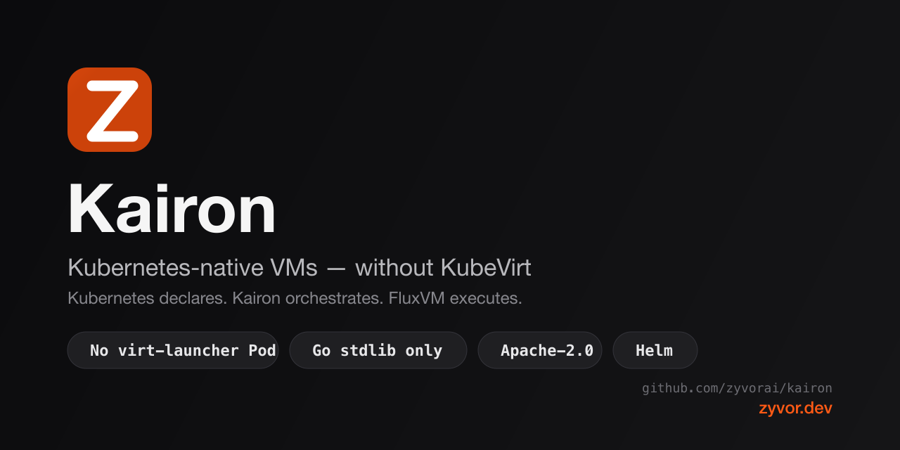

<div align="center">

# Kairon

### Real VMs, on Kubernetes, without the weight of KubeVirt

**Kubernetes declares. Kairon orchestrates. FluxVM executes.**



[](https://github.com/zyvorai/kairon/actions/workflows/ci.yml)
[](LICENSE)
[](VERSION)
[](go.mod)
[](charts/kairon/Chart.yaml)
[](#the-dashboard)

[Why](#why-kairon-exists) · [Architecture](ARCHITECTURE.md) · [Quick start](#quick-start) · [Dashboard](#the-dashboard) · [Guarding the fleet](#guarding-the-fleet) · [Getting started](docs/getting-started.md) · [Security](SECURITY.md) · [Roadmap](ROADMAP.md) · [zyvor.dev](https://zyvor.dev?utm_source=github&utm_medium=kairon)

</div>

---

## Why Kairon exists

KubeVirt makes a VM look like a Pod: a `virt-launcher` Pod wrapping libvirt wrapping QEMU, scheduled by the Kubernetes Pod scheduler, migrated by machinery bolted onto that same abstraction. It works, but every layer you add is a layer you have to trust, patch, and debug at 2am.

Kairon starts from a different premise: a VM is not a Pod, so stop pretending it is. A `Machine` is desired state in the Kubernetes API. `kairon-controller` places it. `kairon-node` turns that placement into a real [FluxVM](https://github.com/zyvorai/fluxvm) instance — QEMU, Cloud Hypervisor, Firecracker, or the FluxVM hypervisor — on real KVM: Kubernetes-native VMs without KubeVirt, without libvirt, without a `virt-launcher` Pod standing in for the VM, and without a guessed hypervisor migration endpoint smuggled through an annotation.

|  | KubeVirt-style stacks | **Kairon** |
|---|---|---|
| Execution | `virt-launcher` Pod + libvirt | Node agent → FluxVM REST, directly |
| Scheduling | Pod scheduler + virt extras | Kairon's own least-loaded placement |
| Live migrate | Built into the VMM stack | mTLS peer handshake + optional adapter |
| Runtime dependencies | Large Go/operator surface | **Go standard library only** |

Three things follow from that premise, and they shape everything below:

- **Small enough to read in an afternoon.** `go.mod` has no `client-go`, no generated deep call stacks, no vendored operator framework — `kairon-controller` and `kairon-node` are each a handful of files. You can actually audit what's running your VMs, not just trust that someone else did.
- **Kubernetes stays the only source of truth.** A `Machine` object is where desired state lives, full stop. The dashboard (`kairon-ui`) isn't a second database with its own opinions — it's a thin HTTP client with exactly the same standing as `kaironctl` or `kubectl`.
- **An uncertain outcome gets a name, not a guess.** When a live migration's commit result is genuinely ambiguous, Kairon doesn't flip a coin between "assume it worked" and "assume it didn't" — either one risks running the same VM twice. It parks the migration in `NeedsRecovery` and waits for an operator's attested decision. See [Relocating a Machine](#relocating-a-machine).

---

## Who reaches for this

| You are... | You need... | Kairon gives you... |
|---|---|---|
| **A platform engineer replacing KubeVirt** | Real VMs on Kubernetes without adopting `virt-launcher` Pods, libvirt, or a large operator surface | A `Machine` CRD, a stdlib-only controller/agent pair, FluxVM doing the actual KVM work — see the table above |
| **An SRE running a Machine fleet** | Draining a node without taking out more capacity than you can afford; capping what a noisy namespace can consume | `MachineDisruptionBudget` throttles disruption, `MachineQuota` caps `maxMachines`/CPU/memory per namespace — both are now enforceable at admission time, not just convention, see [Guarding the fleet](#guarding-the-fleet) |
| **Whoever's on call for live migration** | A migration commit that can't silently resolve into split-brain | `NeedsRecovery` names the ambiguous case explicitly and parks it for an attested human decision — see [Relocating a Machine](#relocating-a-machine) |
| **An economic buyer sizing up build-vs-adopt** | Honesty about what's real today versus what's still open | Apache-2.0, actively developed, and [Status](#status) below is a punch list, not a marketing page |

---

## Quick start

```bash
# 1. Label the nodes FluxVM actually runs on
kubectl label node worker-1 kairon.zyvor.dev/capable=true

# 2. Install
helm upgrade --install kairon ./charts/kairon --namespace kairon-system --create-namespace

# 3. Run something
kaironctl create demo --image /var/lib/fluxvm/images/ubuntu.qcow2 --cpu 2 --memory 2Gi --backend qemu
kaironctl get machines
```

FluxVM needs to already be listening on each capable node (default `127.0.0.1:7788`) with the image path visible to the host. Prefer raw manifests over Helm? `kubectl apply -f deploy/crd.yaml -f deploy/rbac.yaml -f deploy/controller.yaml -f deploy/node.yaml` does the same thing. Prefer a UI? Jump to [the dashboard](#the-dashboard) once your first Machine is up.

---

## How it fits together

```text
                  kubectl / GitOps / kaironctl / kairon-ui
                                      │
                                      ▼
                 ┌────────────────────────────────────────┐
                 │             Kubernetes API             │
                 │ Machine · MachineMigration · Snapshot  │
                 │ MachineQuota · MachineDisruptionBudget │
                 └────────────────────────────────────────┘
                                      │
                  ┌───────────────────┴────────────────────┐
                  ▼                                        ▼
┌───────────────────────────────────┐      ┌───────────────────────────────┐
│         kairon-controller         │      │          kairon-node          │
│     placement · migration FSM     │      │ FluxVM lifecycle · DRA → VFIO │
│ CSI snapshots · admission webhook │      │        mTLS peer :9443        │
└───────────────────────────────────┘      └───────────────────────────────┘
                                                           │
                                                           ▼
                                     FluxVM local API · migration adapter (Unix socket) · KVM/VMM
```

Kubernetes is the source of truth. FluxVM owns execution. Kairon owns placement, relocation policy, and Kubernetes lifecycle semantics — nothing more, nothing hidden behind an abstraction. `kairon-ui` isn't pictured as a fourth tier because it isn't one: it talks to the same Kubernetes API everything else does. Full write-up: [`ARCHITECTURE.md`](ARCHITECTURE.md) (the ten-minute tour) or [`docs/architecture.md`](docs/architecture.md) (the deep reference).

---

## What ships today

**Machine lifecycle & placement**
- **Machine CRD** — CPU, memory, image, network, power state, volumes, DRA device claims
- **PVC-backed boot disk** — `spec.volumes[0]` resolves through a Bound `PersistentVolumeClaim` to a real host directory (`hostPath`/`local` `PersistentVolume`s today) instead of a hand-placed image file — [guide](docs/guides/machine-storage.md)
- **Placement** — least-loaded scheduling across Ready, capable-labeled nodes, deterministic tie-break, required (hard) `spec.placement.affinity`/`antiAffinity`, plus weighted soft scoring: `preferredAffinity`/`preferredAntiAffinity`, `topologySpreadConstraints`, and a best-effort DRA topology-awareness hint — [guide](docs/guides/machine-placement.md)
- **DRA → VFIO** — an allocated `ResourceClaim`'s PCI BDF against the node's `vfio_devices` administrator allowlist, fail-closed (an empty allowlist denies all passthrough)
- **CPU/memory hotplug** — grow a running Machine's `spec.resources` via FluxVM's real QMP `device_add`/`object-add`, no reboot — [guide](docs/guides/machine-hotplug.md)
- **Guest agent** (`spec.guestAgent`) — real `qemu-guest-agent`-reported `status.guestIP`, including for `user`/SLIRP networking, which has no DHCP lease to parse at all — [guide](docs/guides/machine-guest-agent.md)

**Migration**
- **Cold migrate & evacuate** — stop → reassign → restart, restart-safe in the API
- **Secure live handshake** — TLS 1.3 mTLS `prepare → transfer → commit`, never a user-supplied `tcp:` URI
- **Split-brain guards** — rollback on transfer failure, `NeedsRecovery` on ambiguous commit, adopt-only cutover
- **A real migration adapter ships** — `cmd/kairon-migration-adapter-fluxvm` against real FluxVM endpoints, not just a test double
- **Node fencing is detection + operator-attested action, never a guess** — `kairon-controller` flags a Machine's node `NodeUnreachable` every reconcile tick but never reschedules it itself (that risks running the same VM twice if the node isn't actually dead); `kaironctl fence --reason ...` is the explicit, attested step that clears it for rescheduling — same shape as `NeedsRecovery`. Opt-in `kairon.zyvor.dev/storage-domain`/`network-domain` node labels also let migration preflight block a target when it's *confirmed* to not share storage/network with the source — [guide](docs/guides/machine-fencing.md)

**Guarding the fleet**
- **`MachineDisruptionBudget`** — `kaironctl evacuate` throttles itself against `minAvailable`/`maxUnavailable` instead of taking a whole node's Machines at once — [guide](docs/guides/machine-disruption-budgets.md)
- **`MachineQuota`** — a namespace-scoped `maxMachines`/`maxTotalCpu`/`maxTotalMemory` cap — [guide](docs/guides/machine-quotas.md)
- **Admission webhook** (`webhook.enabled`, opt-in) — both of the above can now be enforced *at admission*, not just in the reconcile loop or `kaironctl`: a `Machine` create that would blow a quota, or a `MachineMigration` create that would violate a budget, gets rejected outright instead of just parked `Pending` or silently allowed. See [Guarding the fleet](#guarding-the-fleet) below.
- **Network Fabric** — `spec.network`, `MachineNetworkPolicy`, `NetworkSecurityGroup`, Service Fabric VIP membership → FluxVM eBPF edge — [reference](docs/network-fabric.md)

**Snapshots**
- **CSI VolumeSnapshot** — `MachineSnapshot` orchestrates a standard snapshot object; `MachineSnapshotRestore` restores one into a *new* `PersistentVolumeClaim` via the standard CSI `dataSource` flow (deliberately doesn't also create a Machine — see the guide for why) — [guide](docs/guides/machine-snapshot-restore.md)

**Operate it**
- **`kaironctl`** — create, start/stop, migrate, evacuate, snapshot, recover
- **`kairon-ui`** — an optional web dashboard, real per-operator login with in-place password change/reset (not "regenerate a hash and redeploy"), a `NeedsRecovery` recovery workflow, and an optional VNC console — see [The dashboard](#the-dashboard)
- **Prometheus metrics + alert rules**, a per-node/cluster migration concurrency quota, `status.dataPlaneEncrypted` visibility into whether a live transfer is actually encrypted
- **`PodDisruptionBudget`** on by default, opt-in `NetworkPolicy`, digest-pinned + Trivy-scanned container images, Helm + raw manifests + CI

Live *memory* transfer needs a node-local [migration adapter](docs/migration-adapter.md) deployed and configured on each node — without one, a live request blocks before the source is touched. Cold migration needs nothing extra and works today.

---

## Relocating a Machine

**Cold** — the proven path, needs shared or identically provisioned images:

```bash
kaironctl migrate demo --strategy cold --target-node worker-2
kaironctl evacuate worker-1   # batch cold/auto migrations off a node, budget-aware
```

**Live** — a secure peer handshake; you pick a *node*, never a raw destination:

```bash
kaironctl migrate demo --strategy live --target-node worker-2 \
  --mode pre-copy --bandwidth-mbps 800 --max-downtime-ms 200
```

```text
controller → source node ──mTLS──▶ target :9443
                      prepare + journal
             ◀── opaque transfer endpoint ──
source adapter transfers ──▶ target commit
                      adopt-only cutover
```

Enable it:

```bash
kubectl -n kairon-system create secret generic kairon-migration-tls \
  --from-file=ca.crt --from-file=tls.crt --from-file=tls.key
helm upgrade --install kairon ./charts/kairon -n kairon-system --set migration.enabled=true
```

Certificates need `serverAuth` + `clientAuth` and the chart's migration server name (default `kairon-node`) — see [`docs/migration-adapter.md`](docs/migration-adapter.md) for the full contract and fail-closed behavior.

If a commit's outcome is genuinely ambiguous, the migration lands in `NeedsRecovery` instead of a guess. Work through it via [`docs/runbook-migration-failures.md`](docs/runbook-migration-failures.md)'s decision tree, or resolve it straight from [the dashboard](#the-dashboard).

---

## Guarding the fleet

`MachineQuota` and `MachineDisruptionBudget` have always existed as reconcile-loop/CLI-level checks — a Machine over quota just stayed `Pending`; a `MachineMigration` created directly through the API skipped `kaironctl evacuate`'s budget check entirely. Both gaps are now closeable with a real `ValidatingWebhookConfiguration`:

```bash
# You bring the certificate -- this chart doesn't mint one for you,
# same posture as migration.tlsSecretName/console.tls.secretName.
kubectl -n kairon-system create secret generic kairon-webhook-tls \
  --from-file=tls.crt --from-file=tls.key

helm upgrade --install kairon ./charts/kairon -n kairon-system \
  --set webhook.enabled=true \
  --set webhook.tlsSecretName=kairon-webhook-tls \
  --set webhook.caBundle="$(base64 -w0 ca.crt)"
```

It reuses the exact decision functions the reconcile loop and `kaironctl evacuate` already had (`internal/controller/quota.go`, `internal/controller/disruption.go`) — not a second implementation to drift out of sync. It only ever evaluates `CREATE`, matching each check's pre-existing scope: an already-scheduled Machine growing via hotplug was never quota-checked either, so the webhook deliberately doesn't become *stricter* than what it backstops. `webhook.failurePolicy` defaults to `Fail` — an outage blocks every `Machine`/`MachineMigration` write cluster-wide rather than silently letting the old bypass back in; flip it to `Ignore` if you'd rather trade that guarantee for availability.

---

## The dashboard

`kairon-ui` is an optional web dashboard (Go backend + a small React/TypeScript SPA) for Machines, Migrations, Snapshots, and — the one workflow that earns a UI on its own — the `NeedsRecovery` operator-attested recovery form. It has no side channel and no second source of truth; it's a thin wrapper over the same Kubernetes API `kaironctl` uses.

| Page | What it shows |
|---|---|
| **Overview** | Fleet tiles by phase, a prominent warning whenever anything is parked in `NeedsRecovery` |
| **Machines** | Table + create form (mirrors `kaironctl create`) + Start / Stop / Console / Migrate / Snapshot / Delete |
| **Migrations** | List with phase badges, a "New Migration" form, an "Evacuate Node" action, `status.dataPlaneEncrypted` badge, and the recovery workflow above |
| **Snapshots** | List + create form |
| **Account** | Change your own password; an admin account can reset another operator's |

```bash
helm upgrade --install kairon ./charts/kairon -n kairon-system --set ui.enabled=true
kubectl -n kairon-system port-forward svc/kairon-ui 8082:8082
```

With no `ui.*` auth values set, the chart seeds one default `admin` account with a random, generated-once password:

```bash
kubectl -n kairon-system get secret kairon-ui-session -o jsonpath='{.data.defaultAdminPassword}' | base64 -d; echo
```

For real, named, per-operator accounts instead:

```bash
kairon-ui -hash-password 'a real password'
helm upgrade --install kairon ./charts/kairon -n kairon-system \
  --set ui.enabled=true \
  --set ui.auth.users[0].username=alice \
  --set ui.auth.users[0].passwordHash='$2a$10$...' \
  --set ui.auth.users[0].admin=true
```

A named account can change its own password from the dashboard (`POST /api/v1/auth/password`) — no more hand-hashing and redeploying. An `admin: true` account can reset anyone else's, which also immediately signs that operator's active sessions out. (The zero-config seeded `admin` account can sign in like anyone else but can't self-service its password yet — graduate to a named account for that.) Every mutating request is logged with method, path, remote address, resulting status, and — for a session-token login — the signed-in username. The legacy shared token (`ui.token`/`ui.existingSecret`, or `ui.allowUnauthenticated=true` for local dev) still works unchanged alongside `ui.auth.users`; treat it like a shared root password if you're still on it.

`ui.replicaCount` (`1` by default) can now go above 1 — session revocation, login lockout, console tickets, and password changes all propagate across replicas via a Kubernetes-native `ConfigMap` this chart creates alongside `kairon-ui`, deliberately not Redis. Propagation is eventually-consistent (~15s), not instant, and login-lockout's failure count is evaluated per-replica, not as one cluster-wide counter — see [`docs/guides/kairon-ui-ha.md`](docs/guides/kairon-ui-ha.md) for what that actually means before you rely on it.

**VNC console** (`--set console.enabled=true`, off by default): a real graphical VNC session in the browser for QEMU-backend Machines, relayed `kairon-ui → kairon-node → the VM's local socket`. Read [SECURITY.md](SECURITY.md)'s "VNC console" section first — FluxVM's own VNC socket has no auth of its own, so this trades convenience for a trust chain suited to a trusted operator team, not a hostile network. That relay hop can now run over TLS (`console.tls.enabled`).

No Kubernetes cluster handy? Bare-metal works too:

```bash
scripts/deploy-remote.sh sus@80.79.5.173 --with-controller --with-ui --with-console --console-tls
```

Installs everything as systemd services; a dashboard token is auto-generated and printed once. `--console-tls` now automates TLS for the console relay hop too — with no cert flags given, it generates a private CA and server certificate locally and installs them on the remote host; pass `--console-tls-cert`/`-key`/`-ca` to bring your own instead. Requires `npm` locally only for `--with-ui` — the one place this script needs Node.js.

---

## Snapshots & devices

```yaml
spec:
  volumes:
    - {name: data, claimName: database-data}
```
```bash
kaironctl snapshot database --name before-upgrade --class csi-snapclass
```

```yaml
spec:
  deviceClaims:
    - name: gpu-claim   # administrator allowlist on the node -- empty allowlist denies all
```

More worked examples: [`examples/`](examples/).

---

## CLI

```text
kaironctl get [machines|migrations|snapshots|quotas|restores] [-n NS]
kaironctl describe NAME
kaironctl create NAME --image PATH [--cpu N] [--memory SIZE] [--backend qemu|…]
                 [--forward hostPort:guestPort[/proto]] [--hostname NAME] [--user NAME]
                 [--ssh-key KEY] [--package PKG] [--runcmd CMD]  # repeatable/cloud-init, see docs/guides/machine-network.md
kaironctl start|stop|delete NAME
kaironctl migrate MACHINE --strategy auto|cold|live --target-node NODE
kaironctl evacuate NODE [--strategy cold|auto]
kaironctl snapshot MACHINE [--name NAME] [--class CLASS]
kaironctl restore SNAPSHOT --target-claim NAME
kaironctl recover MIGRATION --action ACTION --diagnosis DIAGNOSIS --reason REASON
kaironctl fence MACHINE --reason REASON  # only once NodeUnreachable=True and you've confirmed the node is truly gone
kaironctl version
```

Point at a cluster with `KAIRON_KUBE_URL` (e.g. after `kubectl proxy`), or run in-cluster with the mounted service account.

---

## Operability

`kairon-controller` exposes Prometheus metrics on its existing health port (`/metrics`): migration counts by phase, phase age, transfer/downtime histograms, completion counters, a `dataplane_encrypted` gauge. Example alert rules ship in [`charts/kairon/alerts.yaml`](charts/kairon/alerts.yaml) (optionally a real `PrometheusRule` via `metrics.prometheusRule.enabled=true`), each pointing at [`docs/runbook-migration-failures.md`](docs/runbook-migration-failures.md).

`migration.maxConcurrentPerNode`/`migration.maxConcurrentCluster` (both `0` = unlimited) bound how many non-terminal migrations may touch one node or the cluster at once — a lightweight admission control, mainly useful to cap the blast radius of a bulk `kaironctl evacuate`.

All three workloads set CPU/memory `resources:` by default, `kairon-controller`/`kairon-ui` each get a `PodDisruptionBudget` (on by default — voluntary-eviction protection only, not HA), and an opt-in `NetworkPolicy` (`*.networkPolicy.enabled`) restricts their ingress once you tell it which other namespace needs to reach in (`*.networkPolicy.allowIngressFrom` — get this wrong and Prometheus scraping or your ingress controller breaks silently, so it's opt-in rather than default-on). CI runs `govulncheck` on every push, pins every `Dockerfile` base image to a digest, and scans every built image with Trivy; a tag-triggered workflow publishes scanned, digest-pinned images to `ghcr.io/zyvorai/kairon-*`.

Real two-host live-migration testing and a live `NeedsRecovery` drill are documented as runbooks with helper scripts, since they need hardware this repository's own CI doesn't have: [`docs/runbook-multi-host-migration-test.md`](docs/runbook-multi-host-migration-test.md), [`docs/runbook-recovery-drill.md`](docs/runbook-recovery-drill.md).

---

## Develop

```bash
make all        # fmt · vet · lint · test-race · cover-check · build · validate · smoke
make test-race
./scripts/must-gather.sh
```

Runtime code uses the **Go standard library only** — no `client-go`, no generated deep stacks. That's a deliberate constraint, not an oversight: it keeps the control plane small enough to actually audit, and it's why the admission webhook above hand-rolls the small, stable `AdmissionReview` JSON shape (`internal/admission`) instead of pulling in `k8s.io/api`.

Touching the dashboard (`web/`)? `make all` doesn't build the frontend — run its own checks:

```bash
npm --prefix web run typecheck
npm --prefix web test
npm --prefix web run build
```

---

## Documentation map

| Doc | Covers |
|---|---|
| [`ARCHITECTURE.md`](ARCHITECTURE.md) | The ten-minute tour: components, request flow, trust boundaries/deployment topology, design rationale |
| [`docs/getting-started.md`](docs/getting-started.md) | Install, first Machine, cold migrate, live migration, the dashboard, Network Fabric |
| [`docs/tutorials/machine-lifecycle.md`](docs/tutorials/machine-lifecycle.md) | Narrated walkthrough: one Machine through create → relocate → snapshot → restore |
| [`docs/architecture.md`](docs/architecture.md) | Deep reference: the cold/live migration state machines, session durability, CSI/DRA mechanics, operational visibility |
| [`docs/migration-adapter.md`](docs/migration-adapter.md) | The migration adapter HTTP contract, trust boundary, the real `kairon-migration-adapter-fluxvm` implementation |
| [`docs/network-fabric.md`](docs/network-fabric.md) | `MachineNetworkPolicy`/`NetworkSecurityGroup` reference and the FluxVM eBPF edge |
| [`docs/tutorials/network-fabric.md`](docs/tutorials/network-fabric.md) · [`docs/guides/machine-network.md`](docs/guides/machine-network.md) · [`docs/guides/network-policy.md`](docs/guides/network-policy.md) | Network Fabric walkthrough and field-level guides |
| [`docs/guides/machine-quotas.md`](docs/guides/machine-quotas.md) · [`docs/guides/machine-disruption-budgets.md`](docs/guides/machine-disruption-budgets.md) | `MachineQuota`/`MachineDisruptionBudget` reference, including the admission webhook |
| [`docs/runbook-migration-failures.md`](docs/runbook-migration-failures.md) | Diagnosing and resolving `NeedsRecovery`, alert-to-runbook cross-references |
| [`docs/guides/machine-fencing.md`](docs/guides/machine-fencing.md) | `NodeUnreachable`/`Fenced` conditions, `kaironctl fence`'s safety model, storage/network migration preflight labels |
| [`docs/guides/kairon-ui-ha.md`](docs/guides/kairon-ui-ha.md) | Running `ui.replicaCount > 1`: what's shared, how, and its real limits |
| [`docs/runbook-multi-host-migration-test.md`](docs/runbook-multi-host-migration-test.md) · [`docs/runbook-recovery-drill.md`](docs/runbook-recovery-drill.md) | Real two-host live-migration testing; deliberately drilling a `NeedsRecovery` recovery |
| [`ROADMAP.md`](ROADMAP.md) · [`RELEASE_NOTES.md`](RELEASE_NOTES.md) | What shipped per version, what's next; per-release changelog |
| [`SECURITY.md`](SECURITY.md) | Threat model, vulnerability reporting |
| [`CONTRIBUTING.md`](CONTRIBUTING.md) | PR checklist, coverage floor, frontend checks |

---

## Status

**v0.4.0** is tagged and open source; the sections above also describe real, tested work merged since then (admission webhooks, dashboard password management, console TLS automation, Helm/CI hardening — see [`RELEASE_NOTES.md`](RELEASE_NOTES.md)'s Unreleased section) ahead of the next tag. Cold relocation, snapshots, DRA bridging, the secure live control plane, and a real FluxVM migration adapter are all real and tested — real two-host live migration has not yet been exercised against real hardware in this repository's own CI (see [Operability](#operability)).

### Production gaps

Still genuinely open, and why:

- **Fencing detection and migration preflight are single-signal, not exhaustive** — fencing only looks at the Kubernetes Node's own `Ready` condition (no independent liveness probe of kairon-node itself), and preflight can only catch a *confirmed* storage/network mismatch when both nodes are labeled with `kairon.zyvor.dev/storage-domain`/`network-domain` — it can't prove compatibility when the labels are unset. Real multi-host fencing/preflight behavior hasn't been exercised against real hardware in this repo's own CI.
- **`topologySpreadConstraints.maxSkew` is accepted but not enforced** — the scheduler minimizes matching-Machine count per domain, it doesn't hard-cap skew between domains.
- **DRA topology-awareness is a best-effort scoring hint, not an allocation decision** — `kairon-controller` has no role in DRA device allocation itself; see [`docs/guides/machine-placement.md`](docs/guides/machine-placement.md).
- **Confidential-compute enforcement (SEV-SNP/TDX), large-scale hardware qualification** — hardware-dependent, not exercisable in CI.
- **PVC-backed boot disks are a first cut**: one boot volume per Machine, `Filesystem`-mode `PersistentVolume`s only, `hostPath`/`local` sources only — Kairon runs no CSI node plugin of its own, so a network-block volume (Ceph RBD, EBS, …) needs to already be attached by something else first.
- **`MachineSnapshotRestore` restores into a new PVC only**, deliberately not also a Machine (see its guide for why), and needs a real CSI snapshotter behind your StorageClass — Rancher's `local-path-provisioner`, a common default, doesn't have one.
- **CPU/memory hotplug is grow-only** (FluxVM has no CPU/DIMM unplug), bounded by headroom reserved at creation (not yet Kairon-configurable), and lost across any stop/start — expected QEMU behavior, not a bug.
- **`kairon-ui` multi-replica state propagation is eventually-consistent, not instant**: `ui.replicaCount > 1` is now supported (session revocation, login lockout, console tickets, and password changes propagate via a shared `ConfigMap`, deliberately not Redis), but cross-replica visibility lands within ~15s, login-lockout's failure count is per-replica not cluster-wide-atomic, and concurrent password changes to two different accounts on two different replicas can still race. See [`docs/guides/kairon-ui-ha.md`](docs/guides/kairon-ui-ha.md). OIDC/SSO is a bigger, separate product decision and isn't implemented.
- **No CRD-version-upgrade story beyond today's single `v1alpha1`** — no conversion webhook or versioning scaffold exists; that's its own project once a `v1beta1`/`v1` is actually needed.
- **The admission webhook (above) only ever evaluates `CREATE`**, matching the reconcile-loop/`kaironctl` checks it backstops exactly — an already-scheduled Machine growing past quota via hotplug isn't caught by either the webhook or the reconcile loop.
- **The VNC console inherits FluxVM's own unauthenticated VNC socket as-is** — Kairon can't add auth/encryption FluxVM itself doesn't have. Its real security rests on kairon-ui's operator auth, a single-use per-session ticket, and the shared cluster-wide token to kairon-node (optionally now over TLS). See [SECURITY.md](SECURITY.md).

Report vulnerabilities privately to **security@zyvor.dev** — see [`SECURITY.md`](SECURITY.md).

---

## License

### Open source (Apache-2.0)

This repository is licensed under the [Apache License, Version 2.0](LICENSE). You may use, modify, and run it for personal, lab, and commercial production use at no charge, subject to Apache-2.0 (preserve notices / NOTICE where required). See [NOTICE](NOTICE).

### Enterprise

Production support, SLAs, and Zyvor Enterprise products are licensed separately. Contact [sales@zyvor.dev](mailto:sales@zyvor.dev) or see [zyvor.dev](https://zyvor.dev).
