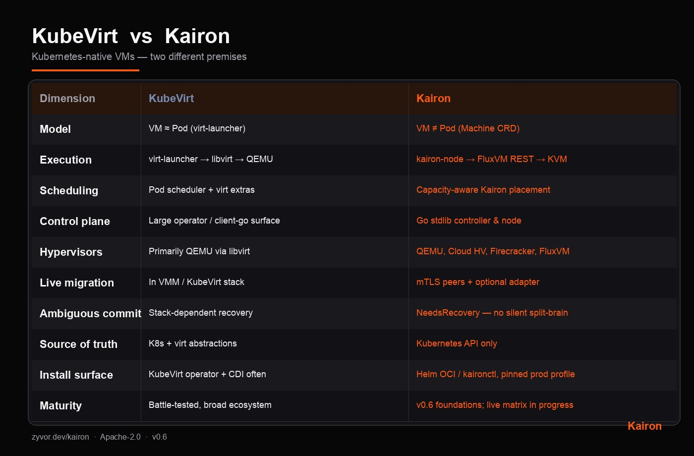

<div align="center">


# Kairon

**Kubernetes declares. Kairon orchestrates.**

Real VMs on Kubernetes — without KubeVirt, without `virt-launcher`, without libvirt.
A `Machine` is desired state. `kairon-controller` places it. `kairon-node` runs it on [FluxVM](https://github.com/zyvorai/fluxvm) / KVM.

[](https://github.com/zyvorai/kairon/actions/workflows/ci.yml)
[](https://github.com/zyvorai/kairon/releases/latest)
[](https://goreportcard.com/report/github.com/zyvorai/kairon)
[](LICENSE)
[](https://zyvor.dev/docs/kairon?utm_source=github&utm_medium=kairon)

[Why](#why-kairon-exists) · [Install](#install) · [Architecture](#architecture) · [What ships](#what-ships) · [Operate](#operate) · [Status](#status) · [Security](SECURITY.md)

</div>

---

## Why Kairon exists

KubeVirt makes a VM look like a Pod: `virt-launcher` wrapping libvirt wrapping QEMU, scheduled by the Pod scheduler. It works — and every layer is another thing you patch and debug at 2am.

Kairon starts from a different premise: **a VM is not a Pod.** A `Machine` is desired state in the Kubernetes API. The controller places it. The node agent turns that into a real FluxVM instance (QEMU, Cloud Hypervisor, Firecracker, or the FluxVM hypervisor) on real KVM — no guessed hypervisor migration endpoint smuggled through an annotation.

<div align="center">

</div>

| Dimension | KubeVirt | **Kairon** |
|---|---|---|
| Model | VM ≈ Pod (`virt-launcher`) | VM ≠ Pod (`Machine` CRD) |
| Execution | virt-launcher → libvirt → QEMU | kairon-node → FluxVM REST → KVM |
| Scheduling | Pod scheduler + virt extras | Capacity-aware Kairon placement |
| Control plane | Large operator / client-go surface | **Stdlib-only** controller & node ([policy](docs/DEPENDENCIES.md)) |
| Hypervisors | Primarily QEMU via libvirt | QEMU, Cloud HV, Firecracker, FluxVM |
| Live migration | In VMM / KubeVirt stack | mTLS peers + optional adapter |
| Ambiguous commit | Stack-dependent recovery | `NeedsRecovery` — no silent split-brain |
| Source of truth | K8s + virt abstractions | Kubernetes API only |
| Install | Operator + CDI (often) | Helm OCI / `kaironctl`, prod profile |
| Maturity | Battle-tested ecosystem | v0.6 foundations; live matrix in progress |

Small enough to read in an afternoon. Kubernetes stays the only source of truth. Ambiguous live-migration commits land in `NeedsRecovery` — never silent split-brain.

---

## Install

**v0.6.0** ships signed images, an OCI Helm chart, CLI binaries, checksums, and SBOM. Production profile pins image tags to `Chart.AppVersion` and turns on webhook, namespace isolation, network default-deny, and migration dataplane TLS.

```bash
# Label nodes where FluxVM listens (default 127.0.0.1:7788)
kubectl label node worker-1 kairon.zyvor.dev/capable=true

# Production install from OCI
helm upgrade --install kairon oci://ghcr.io/zyvorai/charts/kairon \
  --version 0.6.0 -n kairon-system --create-namespace \
  -f https://raw.githubusercontent.com/zyvorai/kairon/v0.6.0/charts/kairon/values-production.yaml

# CLI (linux amd64; also: kaironctl-linux-arm64 — or: kubectl krew install kairon)
curl -fsSL -o kaironctl \
  https://github.com/zyvorai/kairon/releases/download/v0.6.0/kaironctl-linux-amd64
chmod +x kaironctl && sudo mv kaironctl /usr/local/bin/

kaironctl create demo --image /var/lib/fluxvm/images/ubuntu.qcow2 \
  --cpu 2 --memory 2Gi --backend qemu
kaironctl get machines
```

Images: `ghcr.io/zyvorai/kairon-{controller,node,ui}` · Chart: `oci://ghcr.io/zyvorai/charts/kairon` · Release: [v0.6.0](https://github.com/zyvorai/kairon/releases/tag/v0.6.0)

<details>
<summary><strong>From source / kind</strong></summary>

```bash
git clone https://github.com/zyvorai/kairon.git && cd kairon
make docker-build
helm upgrade --install kairon ./charts/kairon -n kairon-system --create-namespace
# or: kaironctl install   (embedded Helm SDK — no helm binary required)
```

Prefer raw manifests? `kubectl apply -f deploy/crd.yaml -f deploy/rbac.yaml -f deploy/controller.yaml -f deploy/node.yaml`. Full walkthrough: [docs/getting-started.md](docs/getting-started.md).

</details>

---

## Architecture

```text
                  kubectl / GitOps / kaironctl / kairon-ui
                                      │
                                      ▼
                 ┌────────────────────────────────────────┐
                 │             Kubernetes API             │
                 │ Machine · MachineMigration · Snapshot  │
                 │ MachineQuota · MachineDisruptionBudget │
                 └────────────────────────────────────────┘
                                      │
                  ┌───────────────────┴────────────────────┐
                  ▼                                        ▼
┌───────────────────────────────────┐      ┌───────────────────────────────┐
│         kairon-controller         │      │          kairon-node          │
│     placement · migration FSM     │      │ FluxVM lifecycle · DRA → VFIO │
│ CSI snapshots · admission webhook │      │        mTLS peer :9443        │
└───────────────────────────────────┘      └───────────────────────────────┘
                                                           │
                                                           ▼
                                     FluxVM local API · migration adapter · KVM/VMM
```

v0.6 foundations: AssignedNode-scoped watches, capacity-aware scheduling, and status skip-patch (no etcd write every reconcile tick). Full write-up: [`ARCHITECTURE.md`](ARCHITECTURE.md) · [`docs/architecture.md`](docs/architecture.md).

---

## What ships

| Area | Highlights |
|------|------------|
| **Lifecycle** | `Machine` / `MachineSet`, instance types, NUMA/pinning, Windows, PVC/CSI boot, hotplug, pause/halt, sandboxes |
| **Migration** | Cold + evacuate, secure live mTLS, `NeedsRecovery`, FluxVM migration adapter, fencing |
| **Fleet guards** | `MachineDisruptionBudget`, `MachineQuota`, opt-in admission webhook |
| **Operate** | `kaironctl` / `kubectl kairon`, optional `kairon-ui` (SSO, VNC), Prometheus, HA leases |
| **Snapshots & net** | `MachineSnapshot`, CSI schedules, `MachineNetworkPolicy`, opt-in Cilium ExternalWorkload |

Inventory with every guide → **[docs/WHAT_SHIPS.md](docs/WHAT_SHIPS.md)**

---

## Operate

```bash
# Relocate
kaironctl migrate demo --strategy cold --target-node worker-2
kaironctl migrate demo --strategy live --target-node worker-2 --mode pre-copy
kaironctl evacuate worker-1 --wait

# Dashboard
helm upgrade --install kairon oci://ghcr.io/zyvorai/charts/kairon \
  --version 0.6.0 -n kairon-system --set ui.enabled=true
kubectl -n kairon-system port-forward svc/kairon-ui 8082:8082
```

→ [Relocating](docs/guides/relocating-a-machine.md) · [NeedsRecovery](docs/runbook-migration-failures.md) · [OIDC](docs/guides/kairon-ui-oidc.md) · [CLI](docs/CLI.md)

---

## Docs

| Goal | Document |
|------|----------|
| Getting started | [docs/getting-started.md](docs/getting-started.md) |
| What ships | [docs/WHAT_SHIPS.md](docs/WHAT_SHIPS.md) |
| Architecture | [ARCHITECTURE.md](ARCHITECTURE.md) · [docs/architecture.md](docs/architecture.md) |
| Status & gaps | [docs/STATUS.md](docs/STATUS.md) |
| Hardware matrix | [docs/COMPATIBILITY.md](docs/COMPATIBILITY.md) |
| OpenSSF / Scorecard | [docs/OPENSSF_BEST_PRACTICES.md](docs/OPENSSF_BEST_PRACTICES.md) |
| Security | [SECURITY.md](SECURITY.md) |
| Contributing | [CONTRIBUTING.md](CONTRIBUTING.md) |

---

## Status

**v0.6.0** — production foundations: status skip-patch, node-scoped watches, capacity scheduling, production Helm profile, release artifacts, expanded CI.

Cold relocation, snapshots, DRA bridging, the secure live control plane, and a real FluxVM migration adapter are tested. **Multi-host live migration is not yet green on the lab matrix** — see [COMPATIBILITY.md](docs/COMPATIBILITY.md). Honest gaps → **[docs/STATUS.md](docs/STATUS.md)**.

Report vulnerabilities to **security@zyvor.dev** — [`SECURITY.md`](SECURITY.md).

---

## License

**Apache-2.0** — use, modify, and run in production at no charge ([LICENSE](LICENSE), [NOTICE](NOTICE)).

Enterprise support and Zyvor products are licensed separately → [sales@zyvor.dev](mailto:sales@zyvor.dev) · [zyvor.dev](https://zyvor.dev).
