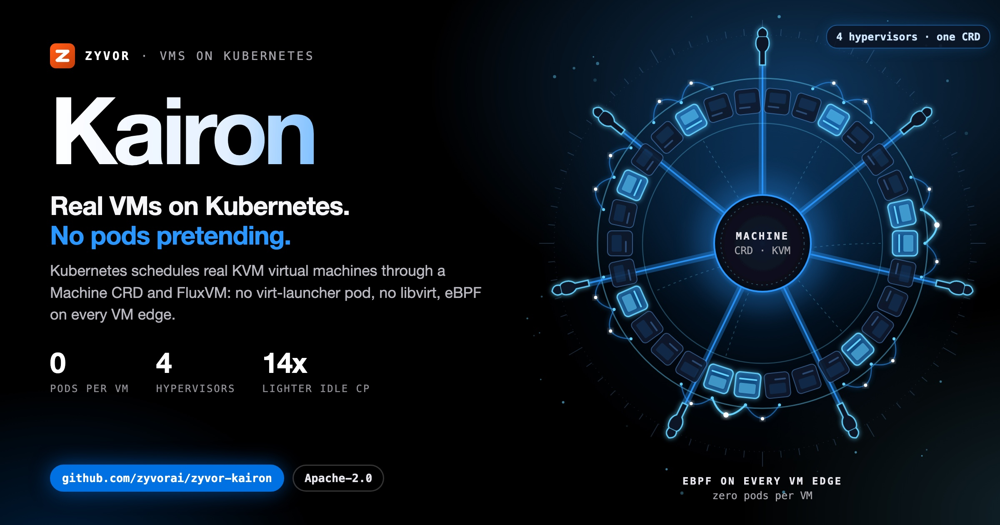
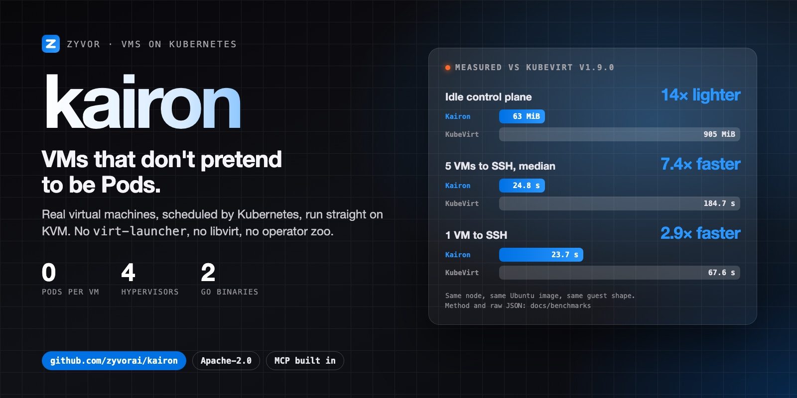
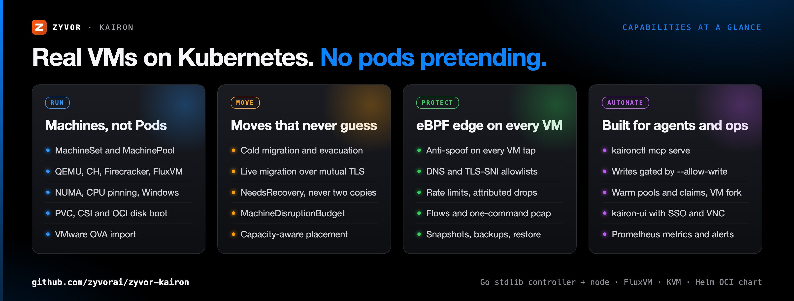
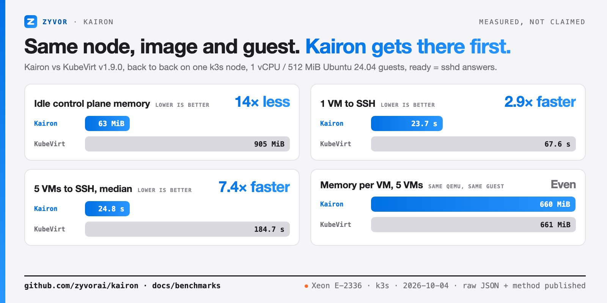
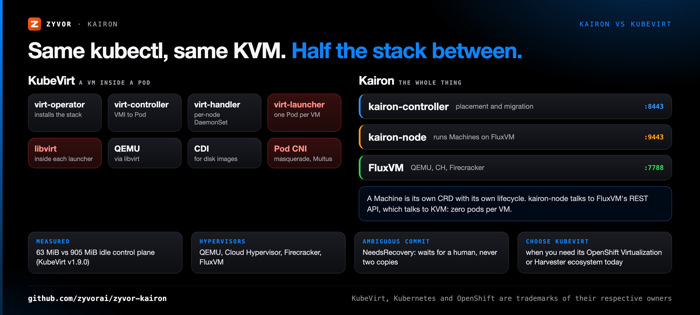
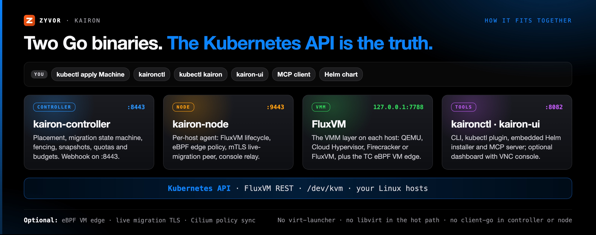
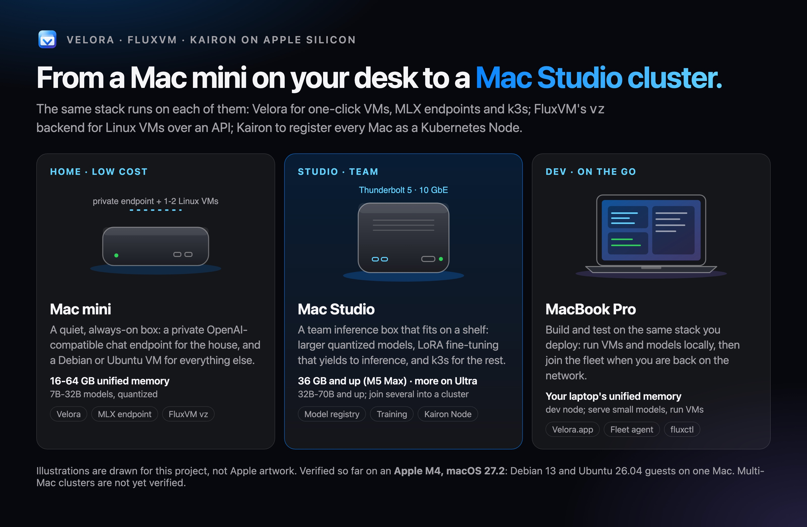

<div align="center">

# Kairon

[](https://github.com/zyvorai/zyvor-kairon/actions/workflows/ci.yml)
[](https://github.com/zyvorai/zyvor-kairon/actions/workflows/mcp.yml)
[](https://github.com/zyvorai/zyvor-kairon/releases/latest)
[](https://goreportcard.com/report/github.com/zyvorai/kairon)
[](https://scorecard.dev/viewer/?uri=github.com/zyvorai/kairon)
[](https://www.bestpractices.dev/projects/15141)
[](LICENSE)
[](docs/DEPENDENCIES.md)

[](https://zyvor.dev/schedule?utm_source=github&utm_medium=kairon&utm_campaign=readme_hero)
[](https://zyvor.dev/poc?utm_source=github&utm_medium=kairon&utm_campaign=readme_hero)
[](#quickstart)



### VMs that don't pretend to be Pods.

**Real virtual machines, scheduled by Kubernetes, run straight on KVM.** No `virt-launcher` pod per VM, no libvirt in the hot path, no operator zoo. A `Machine` is desired state, `kairon-controller` places it, and `kairon-node` runs it on [FluxVM](https://github.com/zyvorai/zyvor-fluxvm) with QEMU, Cloud Hypervisor, Firecracker or FluxVM's own hypervisor.

**Zero pods per VM** · **Four hypervisors, one CRD** · **eBPF on every VM edge** · **No silent split-brain** · **AI agents built in (MCP)**



</div>

---

## What's new

New since v0.6.0 (current: v0.7.2):

| | |
|---|---|
| **Native macOS node** | `kairon-node` registers an Apple silicon Mac as a Node and runs `backend: vz` Machines through FluxVM. Verified on an M4; multi-Mac clusters not yet. [Guide →](docs/macos.md) · [Mac cluster →](docs/macos-cluster.md) |
| **Developer ecosystem kit** | Python and TypeScript SDKs, digest-pinned recipes, disposable-VM GitHub Actions, Terraform composition. [Kit →](ecosystem/README.md) |
| **Fleet automation (experimental)** | Opt-in Redfish fencing, balancing, autoscaling, backup and recovery plans, template claims, usage CSV and a Fleet dashboard. [Guide →](docs/guides/enterprise-fleet.md) |
| **Kairon vs KubeVirt benchmark** | Same node, same guest, one script driving both; method and raw JSON in [docs/benchmarks](docs/benchmarks/kairon-vs-kubevirt.md). |
| **Import from VMware** | `kaironctl import ova` streams an OVA once, reads vCPU, memory and firmware from the OVF, and FluxVM converts and repairs the disk. [Guide →](docs/guides/migrate-from-vmware.md) |
| **Warm pools and claims** | `MachinePool` keeps booted Machines ready; a `MachineClaim` binds one in a single reconcile tick, with per-claim egress allowlists. [Guide →](docs/guides/machine-pools.md) |
| **VM fork** | `kaironctl fork` and the MCP `fork_machine` tool fork a running Machine through FluxVM. [Guide →](docs/guides/machine-fork.md) |
| **Backups** | `MachineBackup` and `MachineBackupRestore` with guest filesystem freeze, plus Atlas S3 backup jobs for Atlas volumes. [Guide →](docs/guides/machine-backup.md) |
| **Live disks and NICs** | Hot-attach PVC disks and hot-add or remove extra NICs on running Machines (`kaironctl disk`, `kaironctl nic`). [Guide →](docs/guides/machine-hotplug.md) |
| **Tenant fence** | `kairon.zyvor.dev/tenant-fence` turns `spec.tenant` into an east-west deny of other tenants' guest addresses in the namespace. [Guide →](docs/guides/tenant-fence.md) |
| **Preemption by Halt** | An opted-in high-priority Machine that can't be placed halts an opted-in lower-priority one, and it resumes when the preemptor leaves. [Guide →](docs/guides/preemption.md) |
| **Hotplug survives restart** | A stop/start boots at the hotplugged CPU and memory; `hotplug-persist` writes it back into spec. [Guide →](docs/guides/machine-hotplug.md#stopstart-keeps-the-realized-size) |
| **Halted resume keeps hotplug** | Resuming a Halted Machine hotplugs its CPU and memory back to the pre-halt size. [Guide →](docs/guides/machine-hotplug.md) |
| **Claims carry the template** | A `createMachine` pool claim gets the template's resources, kernel, cloud-init, NUMA, security, guest agents, TTL and forwards; anything not carried is listed in `machineWarnings`. [Guide →](docs/guides/machine-sandboxes.md#warm-pools) |
| **Daily snapshot schedules** | `dailyAt: "02:30"`, stable jitter and `maxAgeSeconds` retention on `MachineSnapshotSchedule`. [Guide →](docs/guides/machine-snapshot-schedules.md) |
| **CPU-pinning discovery, deployed** | `deploy-remote.sh --reserved-cpus=0-1` or Helm `node.cpuPinning` gives kairon-node kubelet's CPU state, so `pinnable-cpus` is discovered. [Guide →](docs/guides/machine-cpu-pinning.md) |
| **Approval for agent actions** | Destructive MCP tools wait for a single-use `kaironctl approve`. [Guide →](docs/guides/hermes-mcp.md) |
| **Stale evacuation** | Opt-in: Machines marked `evacuate=true` are fenced off a node attested dead with `kaironctl node fence`. [Guide →](docs/guides/machine-fencing.md) |
| **Image catalog and ISO installs** | Cluster-scoped `MachineImage` (disk or ISO, pinned by digest), `spec.cdroms` install media on SATA, blank root disks, and seeding of empty boot volumes. No CDI. [Guide →](docs/guides/machine-images.md) |
| **OCI containerDisk** | `spec.image.source.oci` pulls a disk image by digest with streaming per-layer verification. [Guide →](docs/guides/machine-image-import.md) |

---

## Why Kairon

| When this happens… | Kairon gives you… |
|---|---|
| Every VM drags a `virt-launcher` pod, libvirt and a QEMU wrapper behind it | **Nothing per VM but the VM.** `kairon-node` talks to FluxVM's REST API, which talks to KVM. |
| A migration dies halfway and nobody knows which copy is real | **`NeedsRecovery`.** An ambiguous commit stops the line and asks a human; it never guesses and never runs two copies. |
| You need microVMs for CI and agents, but full VMs for databases | **One `Machine` CRD, four hypervisors**: QEMU, Cloud Hypervisor, Firecracker, FluxVM. Pick per Machine with `spec.backend`. |
| VM networking means Pod CNI tricks, masquerade and Multus | **An eBPF edge on every VM tap**: anti-spoofing, DNS and TLS-SNI policy, rate limits, flows, attributed drops and packet capture. |
| Debugging the control plane means reading a client-go codebase | **Stdlib-only controller and node** ([dependency policy](docs/DEPENDENCIES.md)). Small enough to read in an afternoon. |
| Your AI agent needs to see and drive your fleet | **`kaironctl mcp serve`**: Machines, policies and live network data for Hermes Agent and any MCP client, writes gated behind `--allow-write`. |



---

## The numbers



| | **Kairon** | **KubeVirt v1.9.0** | |
|---|---|---|---|
| Idle control plane memory | **63 MiB** | 905 MiB | 14x less |
| 1 VM to SSH | **23.7 s** | 67.6 s | 2.9x faster |
| 5 VMs to SSH, median | **24.8 s** | 184.7 s | 7.4x faster |
| Memory per VM (5 VMs) | 660 MiB | 661 MiB | Even: same QEMU, same guest |

Same k3s node, same Ubuntu 24.04 image, same 1 vCPU / 512 MiB guest and cloud-init seed, one script driving both, ready meaning the guest's sshd answers. The VM costs the same either way; what you stop paying for is everything KubeVirt puts around it. Method, raw JSON and caveats (including the 10-VM run): [docs/benchmarks](docs/benchmarks/kairon-vs-kubevirt.md).

---

## Kairon vs KubeVirt



Every layer you remove is one less thing to patch, one less log to read and one less process to crash at 2 a.m.

| | **Kairon** | **KubeVirt** |
|---|---|---|
| A VM is | A `Machine`: its own CRD, its own lifecycle | A Pod in disguise (`virt-launcher`) |
| Pods per running VM | **0** | 1 `virt-launcher` pod each |
| Idle control plane, 5 VMs to SSH ([measured](#the-numbers)) | **63 MiB**, **25 s** | 905 MiB, 185 s |
| Path to KVM | `kairon-node` → FluxVM REST → KVM | `virt-handler` → `virt-launcher` → libvirt → QEMU |
| Hypervisors | **QEMU, Cloud Hypervisor, Firecracker, FluxVM** | QEMU via libvirt |
| MicroVMs and warm pools | Firecracker / FluxVM sandboxes, FluxVM warm pools ([24 ms claim measured](https://github.com/zyvorai/zyvor-fluxvm/tree/main/docs/benchmarks)) | Not a target |
| Scheduling | Capacity-aware Kairon placement on real allocatable | Pod scheduler plus virt extras |
| Control plane code | **Go standard library only** (controller, node) | Large client-go / controller-runtime surface |
| VM network | **eBPF VM edge**: anti-spoof, DNS/SNI policy, rate limit, flows, drop reasons, pcap | Pod CNI, masquerade/bridge binding, Multus |
| Network policy | `MachineNetworkPolicy` + `NetworkSecurityGroup`, optional Cilium sync | Pod `NetworkPolicy` |
| Live migration | mTLS node-to-node prepare/commit/abort with an encrypted data plane | libvirt migration inside the virt stack |
| Ambiguous migration commit | **`NeedsRecovery`**: no silent split-brain | Stack-dependent recovery |
| Packet capture of one VM | `kaironctl network capture demo --seconds 15` | Exec into the launcher pod and bring your own tools |
| AI agents | **MCP server built in** (`kaironctl mcp serve`) | Not included |
| Browser console | noVNC relay with per-Machine allowlists and Kubernetes RBAC | `virtctl vnc` / external UI |
| Source of truth | **The Kubernetes API, nothing else** | Kubernetes plus virt abstractions |
| Install | One Helm chart from OCI, or `kaironctl install` | Operator plus CR, CDI for images |
| **Choose KubeVirt when** | | You need its years of ecosystem integrations (OpenShift Virtualization, Harvester) today |

The previous layer-stack illustration: [docs/assets/kairon-vs-kubevirt.jpg](docs/assets/kairon-vs-kubevirt.jpg).

---

## What you get

### Machines, not Pods

`Machine` and `MachineSet` with instance types, NUMA and CPU pinning, Windows guests, PVC and CSI boot, multi-volume virtiofs, CPU/memory hotplug, pause and halt, cloud-init and port forwards. Desired state lives in Kubernetes; the node reconciles it every few seconds. [What ships →](docs/WHAT_SHIPS.md)

```bash
kaironctl create demo --image /var/lib/fluxvm/images/ubuntu.qcow2 --cpu 2 --memory 2Gi --backend qemu
kaironctl get machines
```

### Migration that refuses to guess

Cold migration, node evacuation, and secure live migration over mutual TLS with an encrypted data plane. Cordon a node and the controller can evacuate it for you, throttled by `MachineDisruptionBudget`. When a commit is ambiguous the Machine goes to `NeedsRecovery` and waits for an operator instead of risking two running copies. [Relocating →](docs/guides/relocating-a-machine.md) · [NeedsRecovery runbook →](docs/runbook-migration-failures.md)

### An eBPF edge on every VM

Each VM tap gets FluxVM's eBPF dataplane: anti-spoofing, DNS and TLS-SNI allowlists, rate limits, and drops attributed to a reason (`spoof_ip`, `dns_deny`, `sni_deny`, `rate_limit`, …). Write policy as `MachineNetworkPolicy` / `NetworkSecurityGroup`; see it live in the CLI and the dashboard **Network** panel; capture packets from one VM in one command. [VM edge →](docs/ebpf-edge.md) · [Network fabric →](docs/network-fabric.md)

```bash
kaironctl network flows demo --limit 20
kaironctl network drops demo
kaironctl network capture demo --seconds 15 --output demo.pcap
```

### AI agents, safely


`kaironctl mcp serve` speaks the Model Context Protocol over stdio. Hermes Agent, Claude, Cursor or any MCP client can list Machines, read policies and pull flows, drops and captures. Power, snapshot, capture, sealed-claim and policy-apply tools only appear with `--allow-write`, and every write is recorded in a hash-chained audit log first. `kaironctl agent ask` turns a plain-English request into a validated proposal using any OpenAI-compatible model, and `kaironctl agent diagnose` ranks why a Machine or migration is stuck; neither applies anything, and no model runs in the reconcile loop. Covered end to end in CI with the official MCP SDK. [AI agents →](docs/ai-agents.md) · [Agent plane →](docs/guides/agent-plane.md)

### Snapshots and recovery

`MachineSnapshot`, `MachineSnapshotRestore` and `MachineSnapshotSchedule` on CSI VolumeSnapshots, with guest-agent filesystem freeze for application-consistent snapshots. VM memory snapshots through FluxVM, and CRD backup/restore scripts for disaster recovery. [Snapshots →](docs/guides/machine-snapshot-quiesce.md)

### Fleet guards and operations

`MachineQuota`, `MachineDisruptionBudget`, `MigrationPolicy` and an opt-in admission webhook. `kairon-ui` dashboard with SSO, per-operator accounts and an in-browser VNC console. Prometheus metrics and alerts, controller HA leases, opt-in OpenTelemetry spans. [Observability →](docs/guides/observability.md) · [Security →](SECURITY.md)

---

## How it fits together



| Component | Port | Role |
|---|---|---|
| `kairon-controller` | `:32301` health, `:8443` webhook | Placement, migration state machine, fencing, snapshots, quotas and budgets |
| `kairon-node` | `:32302` health, `:9443` mTLS peer, `:8090` console | Per-host agent: FluxVM lifecycle, eBPF policy, live-migration peer, edge Warning events, confidential-capability label |
| `kairon-ui` | `:18082` | Optional dashboard: Machines, migrations, snapshots, Network panel, VNC console |
| `kaironctl` | — | CLI and `kubectl kairon` plugin, embedded Helm installer, MCP server |
| FluxVM | `127.0.0.1:7788` | The VMM layer on each host: QEMU, Cloud Hypervisor, Firecracker, FluxVM |

Full write-up: [ARCHITECTURE.md](ARCHITECTURE.md) · [docs/architecture.md](docs/architecture.md) · architecture illustration: [docs/assets/readme-architecture.jpg](docs/assets/readme-architecture.jpg)

---

## Quickstart

On a Kubernetes cluster whose VM hosts run [FluxVM](https://github.com/zyvorai/zyvor-fluxvm):

```bash
kubectl label node worker-1 kairon.zyvor.dev/capable=true

helm upgrade --install kairon oci://ghcr.io/zyvorai/charts/kairon \
  --version 0.7.2 -n kairon-system --create-namespace \
  -f https://raw.githubusercontent.com/zyvorai/kairon/v0.7.2/charts/kairon/values-production.yaml

curl -fsSL -o kaironctl https://github.com/zyvorai/kairon/releases/download/v0.7.2/kaironctl-linux-amd64
chmod +x kaironctl && sudo mv kaironctl /usr/local/bin/      # or: kubectl krew install kairon

kaironctl create demo --image /var/lib/fluxvm/images/ubuntu.qcow2 --cpu 2 --memory 2Gi
```

The production profile pins image tags to `Chart.AppVersion` and turns on the webhook, namespace isolation, network default-deny and migration data-plane TLS. Images: `ghcr.io/zyvorai/kairon-{controller,node,ui}`, signed with checksums and SBOM.

From your laptop to a bare-metal host (cross-compiled locally, shipped as static binaries):

```bash
./scripts/deploy-remote.sh user@host                                      # kairon-node + kaironctl
./scripts/deploy-remote.sh user@host --with-controller --with-ui --with-console
```

<details>
<summary><strong>From source, kind, or raw manifests</strong></summary>

```bash
git clone https://github.com/zyvorai/zyvor-kairon.git && cd zyvor-kairon
make docker-build
helm upgrade --install kairon ./charts/kairon -n kairon-system --create-namespace
# or: kaironctl install   (embedded Helm SDK, no helm binary needed)
```

Raw manifests: `kubectl apply -f deploy/crd.yaml -f deploy/rbac.yaml -f deploy/controller.yaml -f deploy/node.yaml`.

</details>

### Requirements

- A Kubernetes cluster whose VM hosts are Linux with `/dev/kvm`.
- FluxVM on each VM host (default `127.0.0.1:7788`).
- For the eBPF edge: a kernel with BTF and cgroup v2, and `dataplaneMode: ebpf`.

| Next step | Where |
|---|---|
| First Machine, end to end | [Getting started](docs/getting-started.md) |
| Everything that ships | [What ships](docs/WHAT_SHIPS.md) |
| Every command | [CLI reference](docs/CLI.md) |
| Hardware evidence | [Compatibility matrix](docs/COMPATIBILITY.md) |

---

## Operate

```bash
# Relocate
kaironctl migrate demo --strategy cold --target-node worker-2
kaironctl migrate demo --strategy live --target-node worker-2 --mode pre-copy
kaironctl evacuate worker-1 --wait

# See the network from the VM's point of view
kaironctl network status demo
kaironctl network drop-reasons demo
kaironctl network identity demo

# Hand the fleet to an AI agent
kaironctl mcp serve                  # add --allow-write for power, snapshot, capture and claims (audited)
kaironctl agent diagnose machine/demo   # ranked causes; adds a model summary when KAIRON_LLM_URL is set

# Dashboard
kubectl -n kairon-system port-forward svc/kairon-ui 18082:18082
```

---

## Maturity

| Area | Status |
|---|---|
| `Machine` lifecycle, MachineSet, instance types, quotas, budgets | Stable |
| Capacity-aware scheduling, node-scoped watches, controller HA | Stable |
| Cold migration and evacuation | Stable |
| Secure live migration and `NeedsRecovery` | Preview, multi-host lab matrix in progress ([COMPATIBILITY](docs/COMPATIBILITY.md)) |
| eBPF VM edge, flows, drops, capture | Preview, single-host lab green |
| CSI snapshots with guest quiesce | Stable |
| `kairon-ui` with SSO and VNC console | Stable |
| MCP server for AI agents | Preview, CI end-to-end with the official SDK |
| CPU/memory hotplug | Grow-only (QEMU) |

**v0.7.2** is the latest release. Real two-host live migration is still Preview: the multi-host lab matrix is not yet green, so it is not claimed as Stable. Honest gaps live in [docs/STATUS.md](docs/STATUS.md); what comes next is in [ROADMAP.md](ROADMAP.md).

---

## Docs

| Goal | Document |
|---|---|
| Getting started | [docs/getting-started.md](docs/getting-started.md) |
| What ships | [docs/WHAT_SHIPS.md](docs/WHAT_SHIPS.md) |
| Architecture | [ARCHITECTURE.md](ARCHITECTURE.md) · [docs/architecture.md](docs/architecture.md) |
| Developer ecosystem | [SDKs, templates, CI and integrations](ecosystem/README.md) |
| AI agents and MCP | [docs/ai-agents.md](docs/ai-agents.md) |
| Status and gaps | [docs/STATUS.md](docs/STATUS.md) |
| Hardware matrix | [docs/COMPATIBILITY.md](docs/COMPATIBILITY.md) |
| Roadmap | [ROADMAP.md](ROADMAP.md) |
| Security | [SECURITY.md](SECURITY.md) · [OpenSSF](docs/OPENSSF_BEST_PRACTICES.md) |
| Contributing | [CONTRIBUTING.md](CONTRIBUTING.md) |

---

## Develop

```bash
make test-race && make cover-check      # Go tests with the race detector, coverage gate
make build smoke                        # binaries and smoke test
cd web && npm install && npm run dev    # dashboard UI
```

Start with [CONTRIBUTING.md](CONTRIBUTING.md); the dependency rules are in [docs/DEPENDENCIES.md](docs/DEPENDENCIES.md).

---

## Part of the Zyvor stack

| Product | Role next to Kairon |
|---|---|
| **Kairon** | VMs on Kubernetes without KubeVirt |
| **[FluxVM](https://github.com/zyvorai/zyvor-fluxvm)** | The VMM layer Kairon runs on: QEMU, Cloud Hypervisor, Firecracker and its own hypervisor, eBPF VM edge, sandboxes, fork |
| **[Atlas](https://github.com/zyvorai/zyvor-atlas)** | Storage: `kairon-controller` provisions Machine volumes, snapshots and S3 backups through Atlas |
| **[Machina](https://github.com/zyvorai/zyvor-machina)** | Private cloud on plain Linux + KVM: fleet, HA/DRS, Fleet Cloud, native eBPF, Zyra AI |
| **[GuestKit](https://github.com/zyvorai/zyvor-guestkit)** | Pairs with Kairon: in-guest agent, offline inspection and repair, per-container eBPF policy |

→ [zyvor.dev](https://zyvor.dev)

---

## License

Kairon is **free and open source** under the [Apache License 2.0](LICENSE) (see [NOTICE](NOTICE)): use, modify and run it in production at no charge. That does not change.

**Zyvor Enterprise** adds what production teams ask for: supported releases, deployment and upgrade guidance, priority incident triage, a named technical contact and 24x7 critical intake. Plans and terms: [docs/SUBSCRIPTION-MODEL.md](docs/SUBSCRIPTION-MODEL.md) · [Pricing](https://zyvor.dev/pricing?utm_source=github&utm_medium=kairon&utm_campaign=readme_license) · [sales@zyvor.dev](mailto:sales@zyvor.dev).

Bugs and feature requests → [GitHub Issues](https://github.com/zyvorai/zyvor-kairon/issues). Report vulnerabilities privately to **security@zyvor.dev** or via [GitHub private vulnerability reporting](https://github.com/zyvorai/zyvor-kairon/security/advisories/new); see [SECURITY.md](SECURITY.md). Contributions: [CONTRIBUTING.md](CONTRIBUTING.md).

---

<div align="center">

### Ready to retire `virt-launcher`?

[](https://zyvor.dev/schedule?utm_source=github&utm_medium=kairon&utm_campaign=readme_footer)
[](https://zyvor.dev/poc?utm_source=github&utm_medium=kairon&utm_campaign=readme_footer)
[](https://zyvor.dev/pricing?utm_source=github&utm_medium=kairon&utm_campaign=readme_footer)
[](mailto:sales@zyvor.dev?subject=Kairon)
[](https://github.com/zyvorai/zyvor-kairon)

</div>

## Native macOS

Kairon builds and runs natively on Apple silicon and can schedule Machines onto a Mac through FluxVM's `vz` backend. See [docs/macos.md](docs/macos.md) for what is verified and the limits.



Every Mac becomes a Kubernetes Node: a [Mac mini](https://www.apple.com/in/mac-mini/) at home, a [Mac Studio](https://www.apple.com/in/mac-studio/) for a team, a [MacBook Pro](https://www.apple.com/in/macbook-pro/) that comes and goes. Kairon places Machines by allocatable unified memory, FluxVM runs them, and [Velora](https://github.com/zyvorai/zyvor-velora) serves private OpenAI-compatible LLM endpoints on the same hardware. A few Mac Studios become a quiet, low-power, on-premise inference cluster.


**Verified** on an Apple M4, macOS 27.2: a Mac registered as a Ready Node, a `vz` Machine scheduled, booted, SSH, deleted. **Not yet verified:** multi-Mac clusters, Thunderbolt RDMA. Cluster guide with a multi-Mac example ([`examples/macos-fleet.yaml`](examples/macos-fleet.yaml)), sizing and roadmap, after GK Servis's [Mac Studio case study](https://www.gkservis.com/case-studies/llm-inference-cluster.html): [docs/macos-cluster.md](docs/macos-cluster.md).
