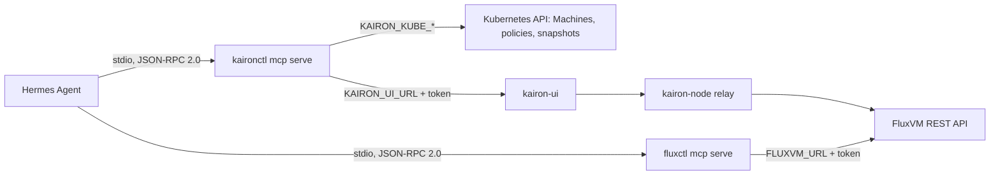

# AI agent integration (MCP)

Kairon and FluxVM each ship a [Model Context Protocol](https://modelcontextprotocol.io)
(MCP) server, so an AI agent can inspect and, if you allow it, operate your
VMs. The servers are written for [Hermes Agent](https://github.com/NousResearch/hermes-agent)
and work with any MCP client that can launch a local process (Claude Code,
Cursor, Claude Desktop, and others).

| Server | Command | Sees | Reference |
| --- | --- | --- | --- |
| Kairon | `kaironctl mcp serve` | Machines across the cluster, network policies, VM-edge data through kairon-ui | [guides/hermes-mcp.md](guides/hermes-mcp.md) |
| FluxVM | `fluxctl mcp serve` | The VMs, host readiness and console logs of one FluxVM daemon | FluxVM `docs/mcp.md` |

Use the Kairon server for the cluster view (which Machine, where, desired
state) and the FluxVM server for the host view (the runtime record, the
console log, the live datapath). An agent with both can follow a problem
from a Machine down to its VM.

## How it fits together



- The agent starts each server as a child process and talks to it over
  stdin/stdout. Nothing listens on a port, and nothing runs when the agent
  is not running.
- The servers are thin: every tool is one or two calls to an API that
  already exists (the same ones `kaironctl` and `fluxctl --server` use). No
  daemon changed to support them.
- They hold no identity of their own. They act with the credentials in
  their environment, so those credentials are the real permission
  boundary.

## Tools at a glance

Read tools are always available. Write tools exist only when the server is
started with `--allow-write`; otherwise they are neither listed to the agent
nor callable.

| Kairon tool | Arguments | Kind |
| --- | --- | --- |
| `list_machines` | `namespace` (omit for all) | read |
| `get_machine` | `name`, `namespace` | read |
| `list_network_policies` | `namespace` (omit for all) | read |
| `machine_network` | `name`, `namespace`, `kind`, `limit` | read |
| `machine_edge_identity` | `name`, `namespace` | read |
| `machine_volumes` | `name`, `namespace` | read |
| `get_machine_snapshot` | `name` (snapshot), `namespace` | read |
| `list_machine_pools` | `namespace` | read |
| `set_power_state` | `name`, `namespace`, `state` (`Running`, `Stopped`, `Paused`, `Halted`) | write |
| `create_snapshot` | `name`, `namespace`, `snapshotName`, `class` | write |
| `snapshot_volume` | `name`, `namespace`, `volume`, `snapshotName`, `class` | write |
| `network_capture` | `name`, `namespace`, `seconds` (1-30), `filter`, `output` | write |
| `claim_machine` | `pool`, `namespace`, `name`, `labels`, `retain`, `ttlSeconds`, `waitSeconds` (0-120), `egress` | write |
| `release_claim` | `name` (claim), `namespace` | write |
| `delete_machine` | `name`, `namespace` | write |
| `machine_disk` | `name`, `namespace`, `action` (`attach`, `detach`), `disk`, `claim` | write |
| `machine_nic` | `name`, `namespace`, `action` (`add`, `remove`), `nic`, `bridge`, `mac` | write |
| `list_backups` | `namespace` | read |
| `machine_backup` | `name`, `namespace`, `action` (`create`, `restore`, `delete`), `backup`, `quiesce`, `atlas`, `storageClass` | write |

`machine_network` `kind` is one of `network-effective`, `network-stats`,
`network-flows`, `network-drops`, `network-drop-reasons` or
`network-capture`.

| FluxVM tool | Arguments | Kind |
| --- | --- | --- |
| `list_vms` | `selector` (label selector) | read |
| `get_vm` | `vm` | read |
| `host_status` | — | read |
| `vm_network` | `vm`, `kind`, `limit` | read |
| `vm_logs` | `vm`, `lines` (1-500) | read |
| `vm_power` | `vm`, `op` (`start`, `stop`, `pause`, `resume`, `restart`) | write |
| `vm_capture` | `vm`, `seconds` (1-30), `filter`, `output` | write |

`vm` is a VM name, UUID or unique UUID prefix. `vm_network` `kind` is one of
`status`, `effective`, `stats`, `flows`, `drops`, `drop-reasons`,
`learned-ip`, `conntrack` or `capture`. A Kairon Machine's FluxVM VM is
named `kairon-<namespace>-<name>`.

Not exposed by either server: create, delete, migrate, guest exec, and
edge or policy changes.

## Setup with Hermes

### 1. Install the binaries

`kaironctl` and `fluxctl` must be on the `PATH` of the process that runs
Hermes, or use absolute paths in `command`. Check both:

```bash
kaironctl mcp serve --help
fluxctl mcp serve --help
```

### 2. Create scoped credentials

Kubernetes, for the Kairon server. `list_machines` and
`list_network_policies` without a namespace list cluster-wide, so a
read-only agent needs a ClusterRole:

```yaml
apiVersion: rbac.authorization.k8s.io/v1
kind: ClusterRole
metadata:
  name: kairon-agent-read
rules:
  - apiGroups: ["kairon.zyvor.dev"]
    resources: ["machines", "machinenetworkpolicies", "machinesnapshots"]
    verbs: ["get", "list"]
---
apiVersion: v1
kind: ServiceAccount
metadata:
  name: kairon-agent
  namespace: kairon-system
---
apiVersion: rbac.authorization.k8s.io/v1
kind: ClusterRoleBinding
metadata:
  name: kairon-agent-read
roleRef:
  apiGroup: rbac.authorization.k8s.io
  kind: ClusterRole
  name: kairon-agent-read
subjects:
  - kind: ServiceAccount
    name: kairon-agent
    namespace: kairon-system
```

```bash
kubectl apply -f kairon-agent-rbac.yaml
kubectl -n kairon-system create token kairon-agent --duration=24h
```

To let the agent change power state, add `patch` on `machines`; to take
snapshots, add `create` on `machinesnapshots`. Bind a namespaced Role
instead to confine it to one namespace (then always pass `namespace`).

kairon-ui, for `machine_network` and `network_capture`: use a token for an
account that may view the Machines involved. kairon-ui must have
diagnostics enabled (`KAIRON_NODE_CONSOLE_TOKEN` on kairon-ui and
kairon-node), otherwise these tools return HTTP 501.

FluxVM: with `auth.require` on, a `read-only` token covers the read tools
except `vm_network` with `conntrack` or `capture`, which need `admin`. The
write tools need `admin`.

### 3. Add the servers to Hermes

Merge into `~/.hermes/config.yaml` (a copy is in
[`.hermes/config.example.yaml`](../.hermes/config.example.yaml)):

```yaml
mcp_servers:
  kairon:
    command: kaironctl
    args: ["mcp", "serve"]
    env:
      KAIRON_KUBE_URL: "https://k8s.example:6443"
      KAIRON_KUBE_TOKEN: "<service account token>"
      KAIRON_KUBE_CA: "/etc/kairon/k8s-ca.pem"
      KAIRON_UI_URL: "https://kairon-ui.example"
      KAIRON_UI_TOKEN: "<kairon-ui token>"
    timeout: 120

  fluxvm:
    command: fluxctl
    args: ["mcp", "serve"]
    env:
      FLUXVM_URL: "http://127.0.0.1:7788"
      FLUXVM_TOKEN: "<read-only token>"
    timeout: 120
```

Or from the command line:

```bash
hermes mcp add kairon --command kaironctl --args mcp serve
hermes mcp add fluxvm --command fluxctl --args mcp serve
```

### 4. Load and check

Start Hermes, or run `/reload-mcp` in a running session. Hermes registers
the tools as `mcp_<server>_<tool>`, for example `mcp_kairon_list_machines`
and `mcp_fluxvm_vm_logs`. `hermes mcp test kairon` reports what the server
answered if something is wrong.

### 5. Turn on writes (optional)

Add `--allow-write` to `args` for the server that should be able to act,
and give it credentials that allow the action. You can still narrow what
Hermes offers the model:

```yaml
  kairon:
    command: kaironctl
    args: ["mcp", "serve", "--allow-write"]
    tools:
      include: [list_machines, get_machine, machine_network, set_power_state]
```

A sensible split is a read-only agent for chat and triage, and a separate
Hermes profile or server entry with `--allow-write` for an operator who
approves actions.

## Other MCP clients

Any client that launches stdio servers works. The command, arguments and
environment are the same as above.

Claude Code (`.mcp.json` in a project, or `claude mcp add`), Cursor
(`.cursor/mcp.json`) and Claude Desktop (`claude_desktop_config.json`) use
this shape:

```json
{
  "mcpServers": {
    "kairon": {
      "command": "kaironctl",
      "args": ["mcp", "serve"],
      "env": {
        "KAIRON_KUBE_URL": "https://k8s.example:6443",
        "KAIRON_KUBE_TOKEN": "<token>",
        "KAIRON_UI_URL": "https://kairon-ui.example",
        "KAIRON_UI_TOKEN": "<token>"
      }
    },
    "fluxvm": {
      "command": "fluxctl",
      "args": ["mcp", "serve"],
      "env": {"FLUXVM_URL": "http://127.0.0.1:7788"}
    }
  }
}
```

`hermes import-agent claude-code` converts such a block into Hermes'
`mcp_servers`.

The servers accept MCP protocol versions 2024-11-05, 2025-03-26 and
2025-06-18; a client asking for another version is answered with
2025-06-18. Only the tools capability is implemented (no resources,
prompts or sampling).

## Example workflows

These are prompts that work well and the tool calls they lead to.

**"Why can't web reach api.example.com?"**

1. `list_machines` finds `web` and its node.
2. `machine_network` with `kind: network-drops` shows `dns_deny` drops
   for `api.example.com`, attributed to policy `web-egress`.
3. `list_network_policies` shows `allowDNS: ["example.com"]`. An exact
   entry does not cover subdomains, so `api.example.com` is denied.
4. The agent recommends adding `*.example.com` (or the exact name) to
   `allowDNS`. It cannot change the policy itself.

**"web has been Pending for ten minutes."**

1. `get_machine` shows `status.message` and the conditions (for example
   `Scheduled=False` with a capacity reason).
2. If it has a runtime, `fluxvm` `get_vm` on `kairon-default-web` shows the
   runtime error, and `vm_logs` shows the end of the console log.

**"Is the dataplane healthy on this host?"**

1. `fluxvm` `host_status` reports KVM, the dataplane mode, the BPF and
   Cilium checks, and VMs by status.
2. `vm_network` with `kind: status` for a VM shows whether it is attached,
   on which interface and with which schema.

**"Capture DNS from web for ten seconds."** (needs `--allow-write`)

1. `network_capture` with `seconds: 10`, `filter: "udp port 53"` and
   `output: "/tmp/web-dns.pcap"` waits and writes the pcap.
2. The agent can then read it with a terminal tool (`tcpdump -nr`).

**"Stop every Machine in the dev namespace."** (needs `--allow-write`)

1. `list_machines` with `namespace: dev`.
2. `set_power_state` with `state: Stopped` for each. kairon-node applies it
   on its next tick; `list_machines` afterwards shows the phase change.

For Kairon-managed VMs, change power state through the Kairon server.
FluxVM's `vm_power` acts on the runtime directly, and Kairon reconciles it
back to the Machine's `spec.powerState`.

## Safety

- **Credentials are the boundary.** The tool list is a convenience; scope
  the Kubernetes token, the kairon-ui account and the FluxVM token to what
  the agent may do.
- **Writes are opt-in per server.** Without `--allow-write`, write tools
  are hidden and rejected.
- **Prompt injection.** Tool results contain data that guests and tenants
  influence: console logs, Machine messages, flow and drop records, DNS
  names. An agent that reads them and has write tools can be steered by
  them. Keep agents that look at untrusted Machines read-only, and have a
  human approve actions.
- **Captures contain payloads.** A pcap holds up to 1,600 bytes of each
  packet, so unencrypted guest traffic is readable by whoever reads it.
  `output` writes the file with the server process's permissions.
- **Bounded output.** Results are capped at 64 KB with a truncation note,
  calls time out (30 s; a capture after its length plus 45 s), and tokens
  never appear in results.

See [SECURITY.md](https://github.com/zyvorai/kairon/blob/main/SECURITY.md)
("MCP server for AI agents").

## Troubleshooting

| Symptom | Cause and fix |
| --- | --- |
| Hermes lists no `mcp_kairon_*` or `mcp_fluxvm_*` tools | The binary is not on Hermes' `PATH`; use an absolute `command`. Run `hermes mcp test <name>`. |
| `kubernetes endpoint not configured` | `KAIRON_KUBE_URL` / `KAIRON_KUBE_TOKEN` missing from the server's `env`. |
| `HTTP 403` from a Kairon tool | The Kubernetes token lacks the verb; extend its Role. |
| `HTTP 501: diagnostics are not enabled` | Set `KAIRON_NODE_CONSOLE_TOKEN` on kairon-ui and kairon-node. |
| A write tool says to start with `--allow-write` | Add it to `args`, then `/reload-mcp`. |
| FluxVM tools fail with `connection refused` | `FLUXVM_URL` is wrong, or the daemon is not running (`fluxctl readyz`). |
| `no VM named or prefixed "web"` | FluxVM names Kairon VMs `kairon-<namespace>-<name>`; use that or the UUID. |
| `invalid arguments: unknown field` | The model sent a field the tool does not take; the error names it. |
| Output ends with `[truncated …]` | Pass `limit`, a `namespace`, or a narrower `kind`. |

To rule out the agent, drive a server by hand. It reads one JSON-RPC
message per line:

```bash
printf '%s\n' \
  '{"jsonrpc":"2.0","id":1,"method":"initialize","params":{"protocolVersion":"2025-06-18"}}' \
  '{"jsonrpc":"2.0","id":2,"method":"tools/list"}' \
  '{"jsonrpc":"2.0","id":3,"method":"tools/call","params":{"name":"list_machines","arguments":{}}}' \
  | kaironctl mcp serve
```

Logs go to stderr; stdout carries only protocol messages.

## For developers

| | Kairon | FluxVM |
| --- | --- | --- |
| Protocol | `internal/mcp` (stdlib only) | `crates/fluxctl/src/mcp.rs` |
| Tools | `internal/kaironctl/mcp.go` | `tools()` in `mcp.rs` |
| Tests | `internal/mcp/server_test.go`, `internal/kaironctl/mcp_test.go` | `mcp::tests` |

To add a tool, append an entry with a name, a one-line description written
for the model, a JSON Schema for the arguments, `Write`/`write` set if it
changes anything, and a call function that returns text. Reuse the CLI's
client code rather than adding a second path to the API. Keep results
compact JSON, keep write tools out of the read set, and add a test that
the tool is hidden without `--allow-write`.
