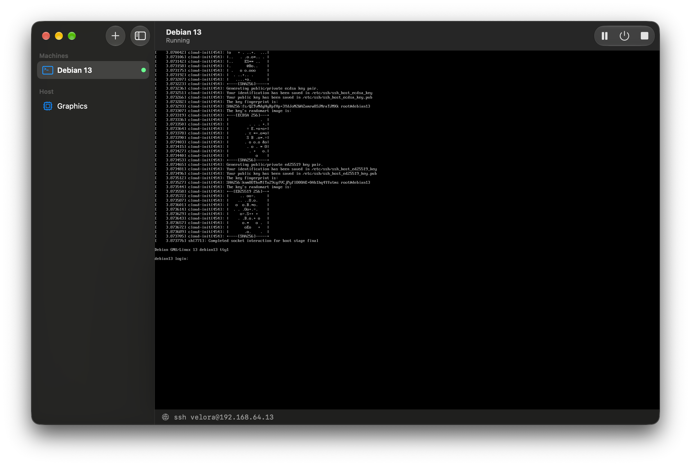
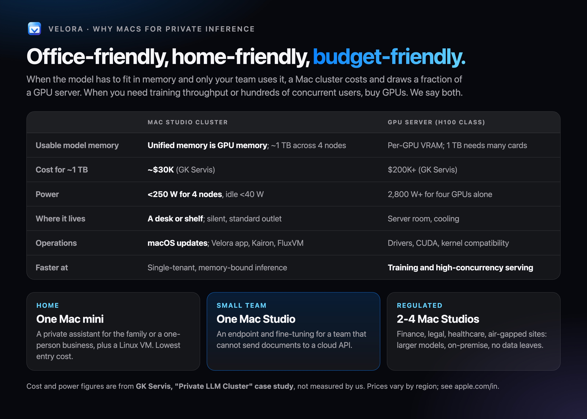

# Kairon on Macs: every Mac a Node, from a Mac mini to a Mac Studio cluster

Kairon's controller and node agent run natively on Apple silicon, and `kairon-node` registers a Mac as a Kubernetes Node
(see [macos.md](macos.md)). That turns a shelf of Macs into one scheduling pool: Kairon places `Machines` by unified memory,
[FluxVM](https://github.com/zyvorai/zyvor-fluxvm) runs them on Virtualization.framework, and
[Velora](https://github.com/zyvorai/zyvor-velora) serves private, OpenAI-compatible LLM endpoints on the same Macs.


## Why Macs

For single-tenant private inference the limit is memory, not FLOPS, and on Apple silicon the GPU uses all of unified memory.
A Mac Studio is a large-memory accelerator that sits on a desk, runs silently from a standard outlet and needs no CUDA stack.
NVIDIA remains faster for training and high-concurrency serving; this page is about the other case.

| Tier | Hardware | Kairon's role |
| --- | --- | --- |
| Home, low cost | [Mac mini](https://www.apple.com/in/mac-mini/) | One Node, a VM or two beside a private chat endpoint |
| Developer | [MacBook Pro](https://www.apple.com/in/macbook-pro/) | A Node that comes and goes; Machines reschedule when it leaves |
| Team | [Mac Studio](https://www.apple.com/in/mac-studio/) (M5 Max, 36 GB and up) | A Node labelled `kairon.zyvor.dev/mlx=true` with an `inference-url` |
| On-premise cluster | 2-4 Mac Studios | One pool; Machines placed by allocatable unified memory |


## How the cluster fits together


1. **Kubernetes API.** Any cluster; Velora can host a single-node k3s in a VM on one of the Macs.
2. **Each Mac** runs `fluxctl serve` (FluxVM, `vz` backend), `kairon-node` with `NODE_NAME` set, and optionally Velora's MLX runtime
   (pass `--mlx-url` so the Node gets `kairon.zyvor.dev/mlx=true` and an `inference-url` annotation).
3. **Allocatable memory** on each Mac Node is unified memory minus the larger of 3 GiB and a quarter, left to macOS and the models.
4. **Machines** tolerate the `kairon.zyvor.dev/vm-only:NoSchedule` taint and select `kairon.zyvor.dev/backend.vz=true`. Add
   `kairon.zyvor.dev/mlx=true` to land next to the models, or `kubernetes.io/hostname` to pin to one Mac.

```bash
kubectl apply -f deploy/crd.yaml -f deploy/rbac.yaml -f deploy/macos/rbac.yaml
kubectl apply -f examples/macos-fleet.yaml      # a gateway VM beside the models, a CI runner on the Mac mini
kubectl get machines -o wide                     # Node and status.guestIP per Machine
```



*A real capture on an Apple M4, macOS 27: a Debian 13 guest on Virtualization.framework, shown in Velora's app.*

- **Network:** 10 GbE for the Kubernetes API, the fleet and VM traffic. A Thunderbolt 5 mesh is for model traffic only, when one
  model is sharded across Macs (roadmap).
- **Reference design:** GK Servis's [Mac Studio LLM inference cluster](https://www.gkservis.com/case-studies/llm-inference-cluster.html)
  (4x Mac Studio, Thunderbolt 5 RDMA, EXO + MLX, about 1 TB pooled, under 250 W). Their figures are theirs, not Kairon measurements.



## Verified and not verified

- **Verified** on an Apple M4, macOS 27.2 (Go 1.27.1): build, vet and all test packages on darwin; `scripts/macos-e2e.sh` against
  a k3s cluster hosted in Velora (Node Ready, a `vz` Machine scheduled and Running through FluxVM, `status.guestIP`, SSH, delete).
- **Not verified:** more than one Mac Node, `examples/macos-fleet.yaml` on real hardware, macOS guests, migration, CSI, the VNC
  console relay, Thunderbolt RDMA.
- **Roadmap for the stack:** a Node label for Thunderbolt-linked peers so sharded models can be co-scheduled, per-node
  temperature and tok/s in kairon-ui, and model-aware placement that reads Velora's memory ledger.

The hardware drawings are original illustrations for this project, not Apple artwork. Mac, Mac mini, Mac Studio and
MacBook Pro are trademarks of Apple Inc.
