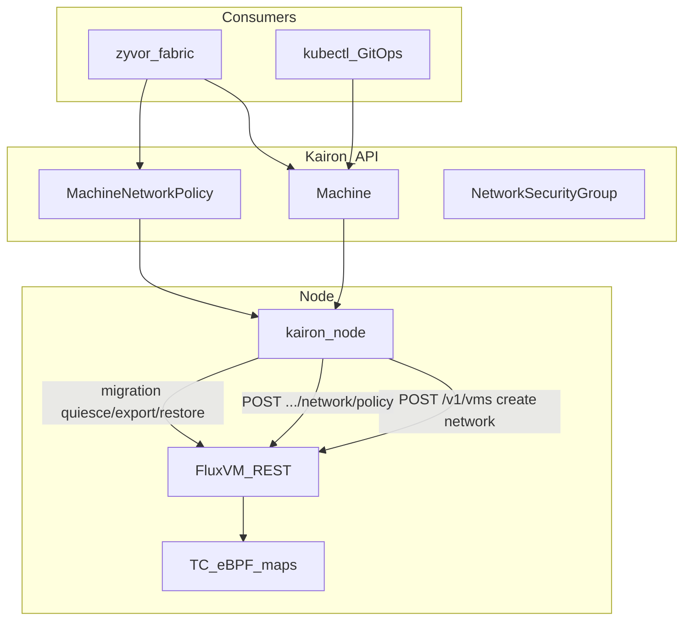

# Network Fabric (Kairon ↔ FluxVM ↔ Fabric)

Kairon declares Kubernetes desired state for VM-edge networking. **FluxVM** owns
TAP/netns, TC/eBPF attach, maps, CNP compile, and Service Fabric VIPs.
**Fabric** owns UX/SDN labels and proxies FluxVM dataplane APIs. Kairon does
**not** own BPF programs, Multus NADs (primary path), or PacketWolf.

## Field → FluxVM → Fabric mapping

| Kairon | FluxVM | Fabric proxy |
|---|---|---|
| `Machine.spec.network.{mode,netns,bridge,parent,mac,tapName,macvtapMode,forwards,staticNetwork,podUID}` | `POST /v1/vms` `network` + `cloud_init.static_network` + `pod_uid` | VM create / edit |
| `Machine.spec.network.dataplaneRequired` | fail-closed on `GET …/network/status` when attach unhealthy | Dataplane health |
| `Machine.spec.serviceFabric.services[]` | merge backend into `POST /v1/network/services` | Service Fabric membership |
| `Machine.status.network.{guestIP,tapName,dataplane.*}` | `guest_ip` / `GET …/network/status` | Dataplane tab |
| `MachineNetworkPolicy` | `POST /v1/vms/{id}/network/policy` (+ optional `POST /v1/network/cnp`) | label→policy |
| `NetworkSecurityGroup` | `POST /v1/network/groups` | security groups |
| live migrate network | `…/network/migration/{quiesce,export,restore,resume}` | cross-node CT/policy continuity |
| observability (pass-through) | `…/network/{stats,flows,drop-reasons}` | `/api/dataplane/hubble/flows` |

## Agent behavior

1. **Create** — map rich `spec.network` into FluxVM create payload (Fabric create parity).
2. **Status** — project guest IP + dataplane attach fields Fabric already expects.
3. **Policy** — when Machine is Running on this node and selected by `machineName` or labels, upsert FluxVM policy; on CR delete, reset every currently-selected Machine to `default_allow: true`. This reset also fails closed: the finalizer only clears once every reset `POST` actually succeeds (idempotently tolerating a selected Machine's VM already being gone), so a real reset failure leaves the `MachineNetworkPolicy` (and its finalizer) in place for a retry on the next tick, rather than the object silently vanishing while a selected VM keeps running under its now-stale restriction.
4. **Groups** — upsert node-local FluxVM security groups from `NetworkSecurityGroup`. Deletion fails closed: the finalizer only clears once `DELETE /v1/network/groups/{name}` actually succeeds (idempotently tolerating "already gone"), so a real delete failure -- FluxVM unreachable, a transient error -- leaves the object (and the finalizer) in place for a retry on the next tick, rather than the Kubernetes object silently vanishing while its FluxVM-side security group state leaks behind, untracked.
5. **Migration** — source quiesce+export before transfer; target restore after prepare; resume after commit (mTLS peer carries opaque snapshot, not CRD status).
6. **Service Fabric** — after guest IP is known, register Machine as backend of named VIPs; `status.appliedServiceFabricMemberships` is Kairon's own ground-truth record of exactly which `(service, port, guestIP)` triples it has actually registered so far, since FluxVM's Service Fabric has no "list what I applied" query of its own. Every reconcile tick while Running also prunes any *previously*-applied entry that this tick's fresh registration didn't reapply — closing the two ways a stale backend could otherwise be left registered on an otherwise still-live Machine: a `spec.serviceFabric.services[]` entry edited out of spec, or (the more insidious one, since it needs no spec edit at all) `guestIP` itself moving to a new address — a DHCP re-lease, or a guest reboot landing on a different lease — which used to just add a second backend for the new address and leave the stale one at the old address registered forever, silently routing VIP traffic nowhere, or — once that old address gets DHCP-reused — at a completely unrelated Machine. On top of that, Machine deletion, `spec.powerState: Stopped`, and `spec.powerState: Halted` deregister every entry in `status.appliedServiceFabricMemberships` before completing (finalizer removal for delete; the status patch to `Stopped`/`Halted` otherwise), covering the case where the guest goes away entirely rather than just moving. Both paths fail closed — a real deregistration error (FluxVM unreachable, a transient error) blocks that completion/tick and gets retried next time, rather than leaving a dead or misattributed backend registered against a VIP indefinitely. A VIP that's already gone is tolerated as nothing left to deregister from.

## Examples

See [`examples/network-fabric-machine.yaml`](../examples/network-fabric-machine.yaml).

## Docs

- Tutorial: [tutorials/network-fabric.md](tutorials/network-fabric.md)
- User guide — Machine networking: [guides/machine-network.md](guides/machine-network.md)
- User guide — policies & groups: [guides/network-policy.md](guides/network-policy.md)

## Non-goals

- Replacing Fabric host nftables SDN (`/api/network-policies`)
- Owning BPF programs inside Kairon
- Multus NAD as the primary attach path
- PacketWolf control plane in Kairon
